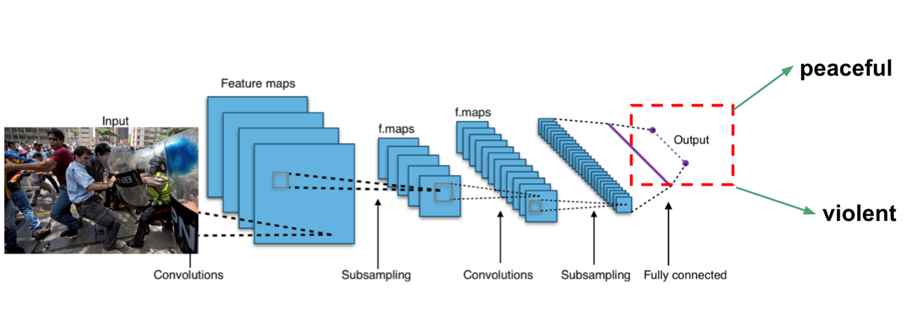
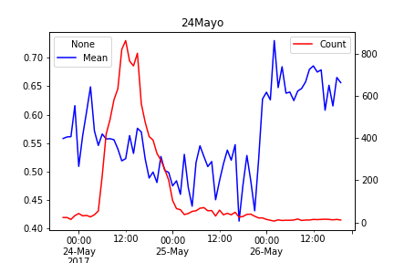

# Microsoft_AI_for_Social_Good_Hackathon

# Safety in Tweets

#### A tool for Venezuelans to gauge the risk of violence during protests in real time.

"Safety in Tweets" is a data science product developed as part of the 2019 hackathon organized by [Microsoft AI for Good](https://www.microsoft.com/en-us/ai/ai-for-good) for [Insight data science](https://www.insightdatascience.com/) fellows, with the aim to identify where and what types of human rights abuses are taking place around the world.

Protesting is one such human right, and an important tool for inspiring positive social change. Unfortunately, protests are not always peaceful, and in some countries violence is perpetrated directly by the State or its actors against its citizens. “Safety in Tweets” uses [Twitter](https://twitter.com/) data from anti-government protests in Venezuela to predict whether a protest will turn violent soon by analyzing sentiment of the tweets. In addition, images from protests in Venezuela were used to built a predictor to classify peaceful vs violent images. The methods developed for this project are applicable to any other country that relies heavily on social media for live news.   


## How does it work?

**Image sentiment analysis:** For image classification, model weights from a resnet50 model were used to train on protest images in a training set, reaching 91% accuracy:

<p align="center">
  
</p>


**Text sentiment analysis::** Tweets were scraped and analyzed by Microsoft's [Sentiment Analysis API](https://westcentralus.dev.cognitive.microsoft.com/docs/services/TextAnalytics-v2-1/operations/56f30ceeeda5650db055a3c9). With hourly averaged sentiment values and tweet count values, changes in sentiment can be detected.

Together, the CNN model and tweet data analysis can provide protesters with information about the sentiment associated with a protest and when it is starting to become very negative and the risk of violence increases.


## Who can use it?

The model presented in this repository can be used by protesters who are on the ground during political demonstrations as a tool to gauge the risk of incipient violence in real time.

## Usage

**Text sentiment analysis:** The folder *main_function_integration* contains a jupyter notebook *main.ipynb* that gets tweets and runs sentiment analysis to generate a plot:

<p align="center">
  
</p>

Low sentiment values indicate a more negative sentiment, and changes in sentiment over time (blue line) were able to capture violence as reported by traditional (non-Twitter) media sources.

**Image sentiment analysis:** The PeaceViolencePredictor notebook uses the trained resnet50 model to determine whether images are peaceful or violent. 

## Requirements
```python
pandas 0.24.0
python-twitter-3.5
gnu parallel (>= version 20160822)
```


## Files

Important files for users:

* main_function_integration
    - main.ipynb - Tweet time series analysis
* PeaceViolencePredictor.ipynb - Predict violence using images of protests.

Other notebooks and files:
* violenceClassifier.ipynb - Train a model to classify violent vs. peaceful images
* tweets_visualization.ipynb - Preprocess text and make wordclouds for a protest
* Tweets_sentiment_wordclouds.ipynb - Preprocess text and make wordclouds for low and high sentiment tweets
* trained_classifier
    - export.pkl - Trained image classifier (peaceful vs violent)


## Microsoft tools
  The [Sentiment Analysis API](https://westcentralus.dev.cognitive.microsoft.com/docs/services/TextAnalytics-v2-1/operations/56f30ceeeda5650db055a3c9), part of [Microsoft Cognitive services](https://azure.microsoft.com/en-us/services/cognitive-services/), was used to analyze changes in tweet sentiment over time.  

Microsoft's [price-winning](https://blogs.microsoft.com/ai/microsoft-researchers-win-imagenet-computer-vision-challenge/) [residual learning framework](https://arxiv.org/abs/1512.03385) to recognize images was utilized to train the model to classify peaceful vs violent images.    
